# 📊 Matomo Docker Setup | Matomo Docker-Setup

This repository demonstrates my ability to set up Matomo using Docker. It showcases my skills in configuring and running a local instance of Matomo Analytics using Docker and Docker Compose, ideal for analytics, web tracking, and data analysis.

Dieses Repository demonstriert meine Fähigkeit, Matomo mit Docker einzurichten. Es zeigt meine Fähigkeiten in der Konfiguration und dem Betrieb einer lokalen Instanz von Matomo Analytics mit Docker und Docker Compose, ideal für Analysen, Web-Tracking und Datenanalyse.

## 👋 About Me | Über mich

I am Rodrigo Teixeira, a Web Content Manager with a passion for data-driven decision-making, web analytics, and digital marketing. This project reflects my hands-on experience with web analytics platforms and containerization, demonstrating my technical skills in setting up environments that prioritize data privacy and user autonomy. I am excited about opportunities that allow me to contribute to web development and analytics, and I look forward to bringing my expertise to your team.

Ich bin Rodrigo Teixeira, ein Web Content Manager mit einer Leidenschaft für datengetriebene Entscheidungsfindung, Web-Analyse und digitales Marketing. Dieses Projekt spiegelt meine praktische Erfahrung mit Web-Analyse-Plattformen und Containerisierung wider und demonstriert meine technischen Fähigkeiten bei der Einrichtung von Umgebungen, die den Datenschutz und die Autonomie der Nutzer in den Vordergrund stellen. Ich freue mich auf Möglichkeiten, zu Webentwicklung und Analyse beizutragen, und darauf, meine Expertise in Ihr Team einzubringen.

## 📄 Overview | Überblick

Matomo is an open-source web analytics platform, similar to Google Analytics, but with a strong emphasis on data privacy and full data ownership. This setup is intended for local development and testing purposes, allowing quick deployment of Matomo on any machine using Docker.

Matomo ist eine Open-Source-Webanalyseplattform, ähnlich wie Google Analytics, jedoch mit starkem Fokus auf Datenschutz und vollständigem Besitz der Daten. Diese Einrichtung ist für die lokale Entwicklung und Testzwecke gedacht und ermöglicht eine schnelle Bereitstellung von Matomo auf jeder Maschine mit Docker.

## 🚀 Setup Instructions | Installationsanleitung

Follow the steps below to set up and run Matomo on your local machine using Docker:

Folgen Sie den untenstehenden Schritten, um Matomo auf Ihrem lokalen Rechner mit Docker einzurichten und auszuführen:

---

### 1️⃣ Clone the Repository | Klonen Sie das Repository

#### English:

Clone this repository to your local machine:

```bash
git clone https://github.com/yourusername/matomo-docker-setup.git
cd matomo-docker-setup
```

#### Deutsch:

Klonen Sie dieses Repository auf Ihren lokalen Rechner:

```bash
git clone https://github.com/yourusername/matomo-docker-setup.git
cd matomo-docker-setup
```

---

### 2️⃣ Start Matomo | Starten Sie Matomo

#### English:

Use Docker Compose to start the Matomo and MariaDB containers:

```bash
docker-compose up -d
```

#### Deutsch:

Verwenden Sie Docker Compose, um die Matomo- und MariaDB-Container zu starten:

```bash
docker-compose up -d
```

---

### 3️⃣ Access Matomo | Zugriff auf Matomo

#### English:

Open your web browser and go to:

```bash
http://localhost:8080
```

#### Deutsch:

Öffnen Sie Ihren Webbrowser und gehen Sie zu:

```bash
http://localhost:8080
```

---

### 1️⃣ Welcome | Willkommen

#### English:


**Explanation**: The blue square highlights the **"NEXT"** button. This is where you begin the Matomo installation process by confirming the welcome message and moving on to the next step. Click on the "NEXT" button to proceed with the installation.

#### Deutsch:
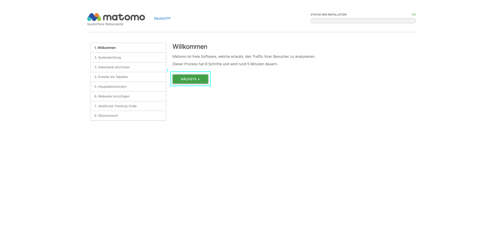

**Erklärung**: Das blaue Quadrat hebt die **"NÄCHSTE"** Schaltfläche hervor. Hier starten Sie den Installationsprozess von Matomo, indem Sie die Willkommensnachricht bestätigen und mit dem nächsten Schritt fortfahren. Klicken Sie auf "NÄCHSTE", um fortzufahren.

---

### 2️⃣ System Check | Systemprüfung

#### English:
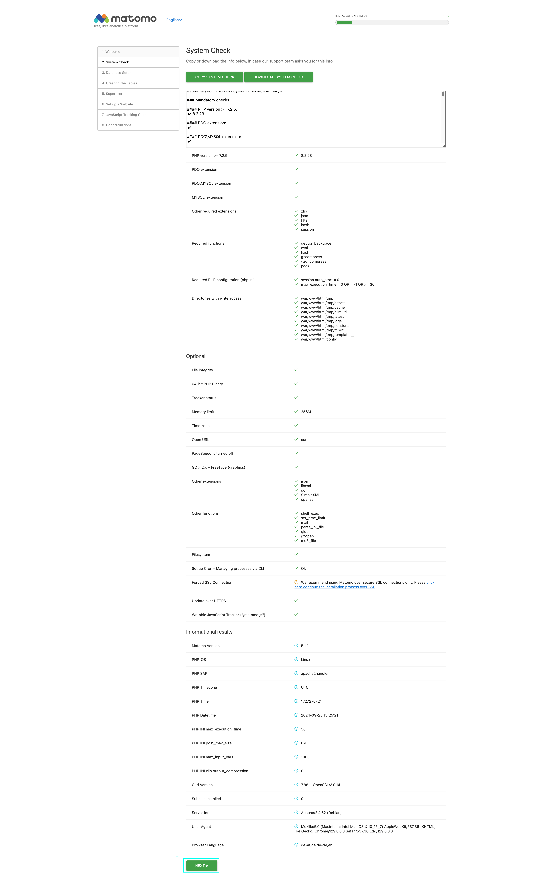

**Explanation**: The blue square highlights the **"NEXT"** button, indicating that the system check was successful. It checks your server environment and configuration for compatibility with Matomo. Once the system check passes, click "NEXT" to proceed.

#### Deutsch:
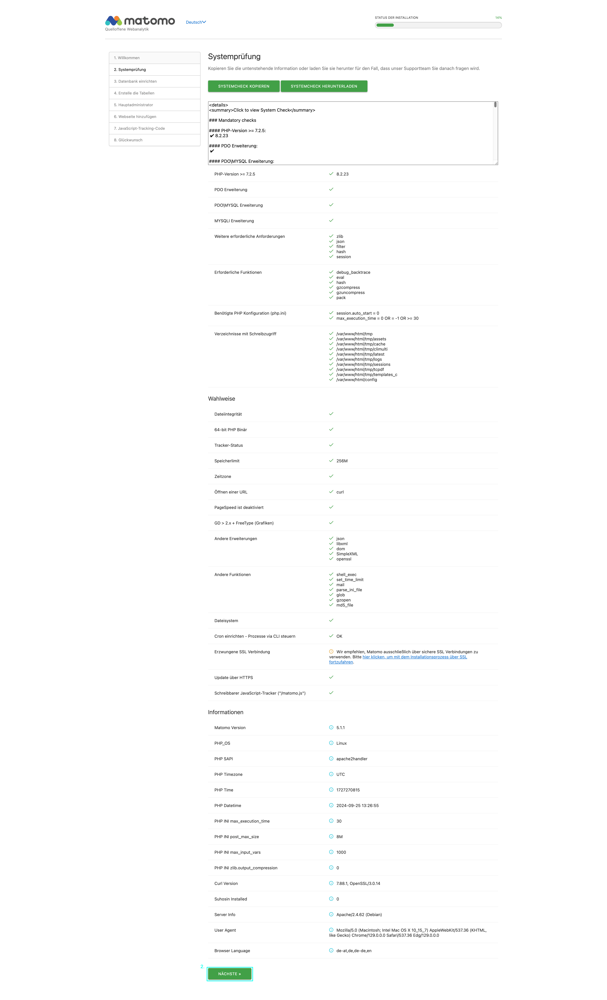

**Erklärung**: Das blaue Quadrat hebt die **"NÄCHSTE"** Schaltfläche hervor und zeigt an, dass die Systemprüfung erfolgreich war. Es wird geprüft, ob Ihre Serverumgebung und Konfiguration mit Matomo kompatibel sind. Wenn die Systemprüfung bestanden ist, klicken Sie auf "NÄCHSTE", um fortzufahren.

---

### 3️⃣ Database Setup | Datenbank einrichten

#### English:
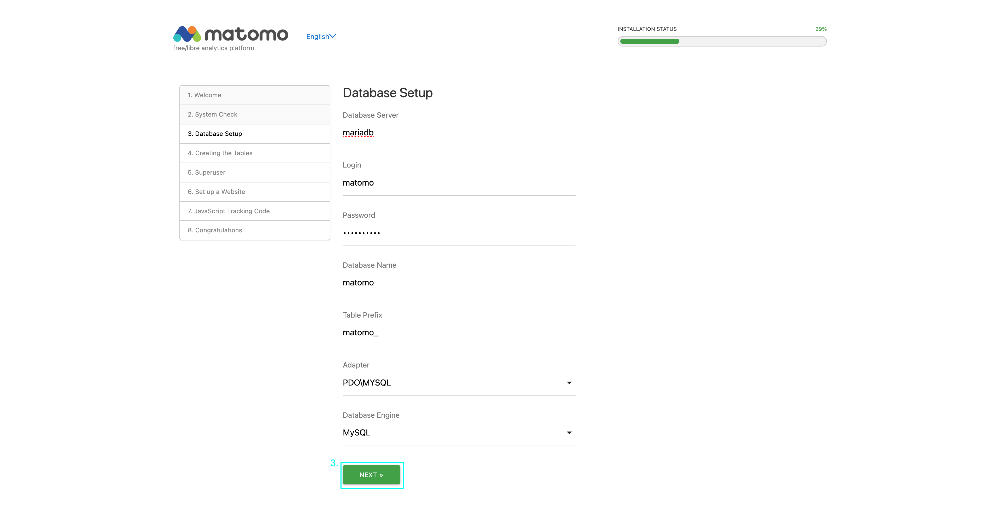

- **Database Server:** `mariadb`
- **Database Name:** `matomo`
- **User:** `matomo`
- **Password:** `matomo_secret`

Create a superuser account with your preferred credentials to access the Matomo dashboard.

**Explanation**: The blue square highlights the **"NEXT"** button after you've entered the required database credentials (e.g., Database Server, Login, Password, and Database Name). Click "NEXT" once you've filled in the correct database details to continue.

#### Deutsch:
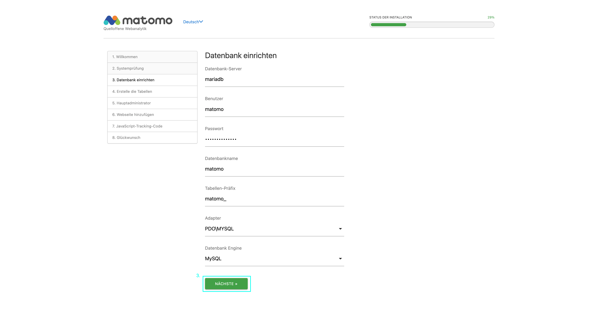

- **Datenbank-Server:** `mariadb`
- **Datenbank-Name:** `matomo`
- **Benutzer:** `matomo`
- **Passwort:** `matomo_secret`

Erstellen Sie ein Superuser-Konto mit Ihren bevorzugten Zugangsdaten, um auf das Matomo-Dashboard zuzugreifen.

**Erklärung**: Das blaue Quadrat hebt die **"NÄCHSTE"** Schaltfläche hervor, nachdem Sie die erforderlichen Datenbankanmeldeinformationen (z. B. Datenbankserver, Login, Passwort und Datenbankname) eingegeben haben. Klicken Sie auf "NÄCHSTE", nachdem Sie die richtigen Datenbankdetails eingegeben haben, um fortzufahren.

---

### 4️⃣ Creating the Tables | Erstelle die Tabellen

#### English:
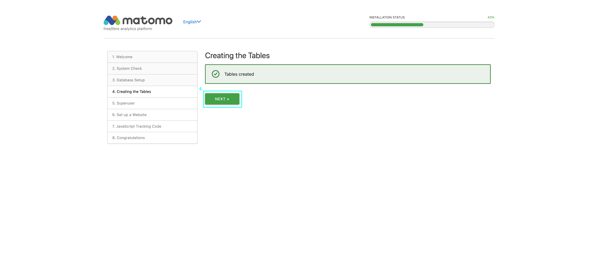

**Explanation**: The blue square highlights the **"NEXT"** button. Once Matomo has successfully created the necessary database tables, you can click "NEXT" to continue to the next configuration step.

#### Deutsch:


**Erklärung**: Das blaue Quadrat hebt die **"NÄCHSTE"** Schaltfläche hervor. Sobald Matomo erfolgreich die erforderlichen Datenbanktabellen erstellt hat, können Sie auf "NÄCHSTE" klicken, um mit dem nächsten Konfigurationsschritt fortzufahren.

---

### 5️⃣ Superuser Setup | Haupadministrator Einrichten

#### English:


**Explanation**: The blue square highlights the **"NEXT"** button after you've entered the credentials for the Superuser (admin account). This account is the main administrator for Matomo. Once your credentials are set, click "NEXT" to continue.

#### Deutsch:
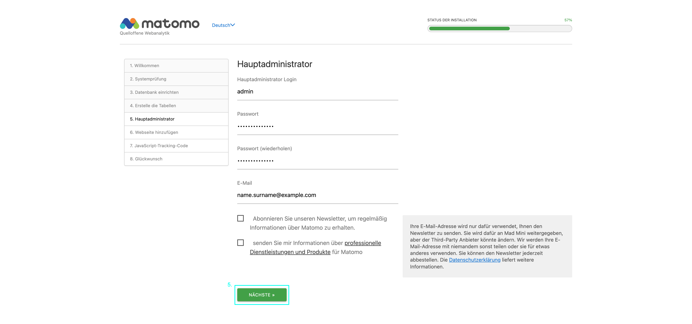

**Erklärung**: Das blaue Quadrat hebt die **"NÄCHSTE"** Schaltfläche hervor, nachdem Sie die Anmeldedaten für den Hauptadministrator (Superuser-Konto) eingegeben haben. Dieses Konto ist der Hauptadministrator für Matomo. Sobald Ihre Anmeldedaten festgelegt sind, klicken Sie auf "NÄCHSTE", um fortzufahren.

---

### 6️⃣ Set up a Website | Webseite hinzufügen

#### English:
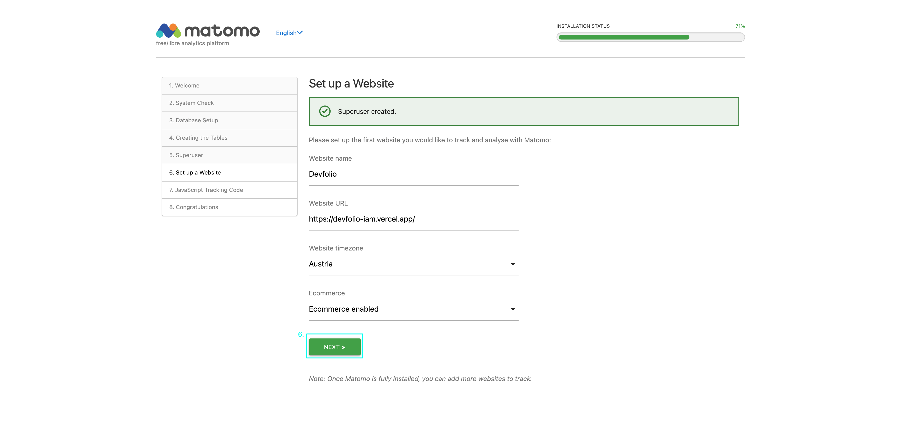

**Explanation**: The blue square highlights the **"NEXT"** button after you've entered the details of the website you want to track (Website Name, URL, Timezone, etc.). Click "NEXT" once you're done.

#### Deutsch:
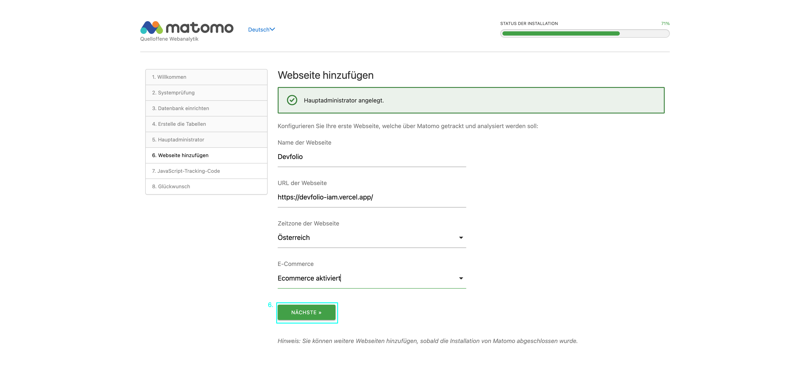

**Erklärung**: Das blaue Quadrat hebt die **"NÄCHSTE"** Schaltfläche hervor, nachdem Sie die Details der Website, die Sie verfolgen möchten (Webseitenname, URL, Zeitzone usw.), eingegeben haben. Klicken Sie auf "NÄCHSTE", sobald Sie fertig sind.

---

### 7️⃣ JavaScript Tracking Code | JavaScript-Tracking-Code

#### English:
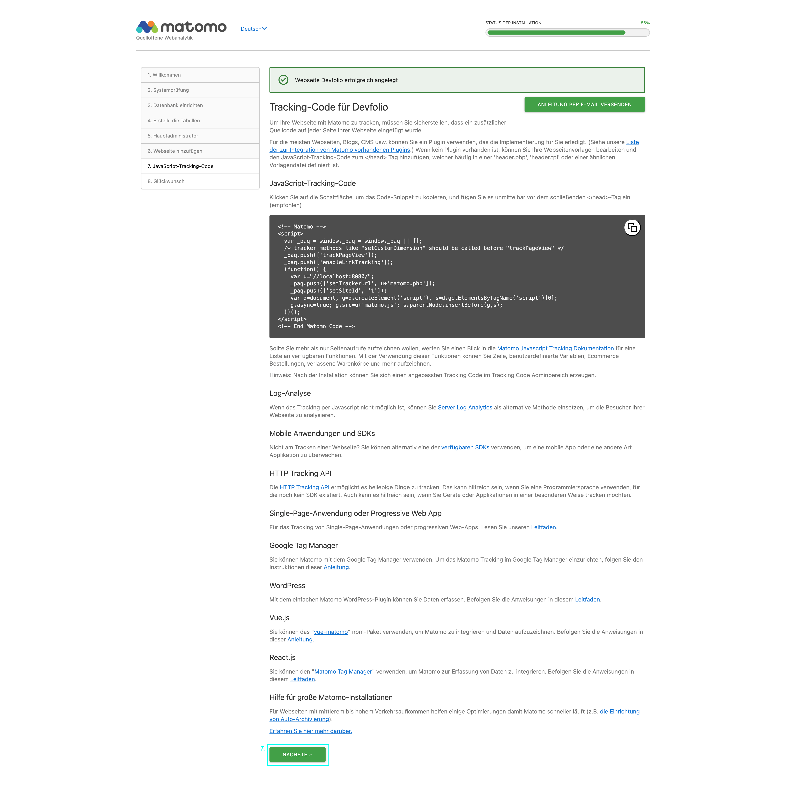

**Explanation**: The blue square highlights the **"NEXT"** button after viewing the JavaScript tracking code. This code needs to be added to your website’s HTML to enable tracking. After copying the code or saving it for later, click "NEXT."

#### Deutsch:
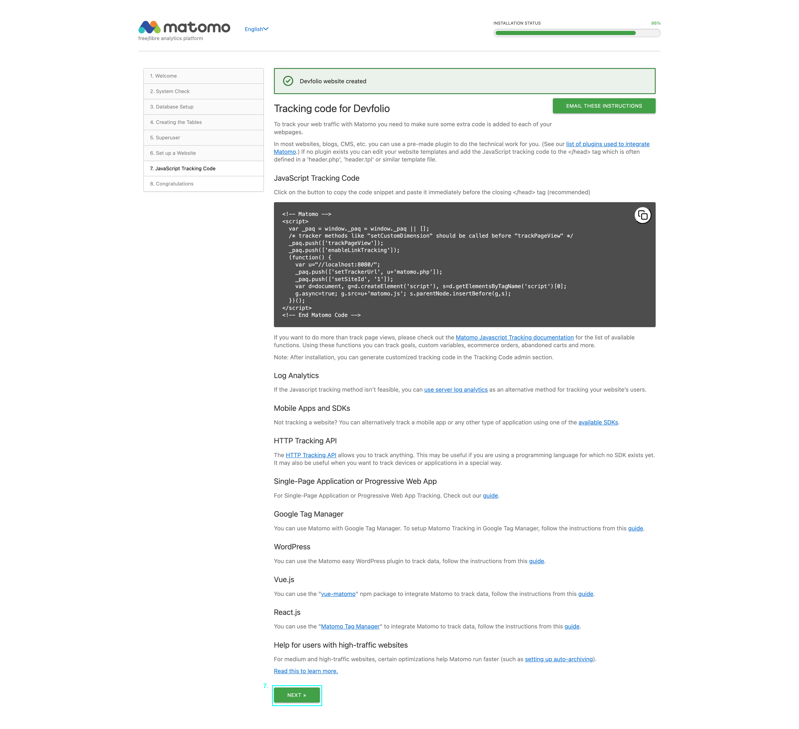

**Erklärung**: Das blaue Quadrat hebt die **"NÄCHSTE"** Schaltfläche hervor, nachdem Sie den JavaScript-Tracking-Code angezeigt haben. Dieser Code muss dem HTML Ihrer Website hinzugefügt werden, um das Tracking zu ermöglichen. Nachdem Sie den Code kopiert oder für später gespeichert haben, klicken Sie auf "NÄCHSTE."

---
---

## ⚙️ Docker Configuration | Docker-Konfiguration

The `docker-compose.yml` file contains the configuration for the Matomo and MariaDB services:

Die Datei `docker-compose.yml` enthält die Konfiguration für die Matomo- und MariaDB-Dienste:

```yaml
version: '3.7'

services:
  matomo:
    image: matomo:latest
    ports:
      - "8080:80"
    volumes:
      - ./matomo:/var/www/html
    environment:
      - MATOMO_DATABASE_HOST=mariadb
      - MATOMO_DATABASE_ADAPTER=mysqli
      - MATOMO_DATABASE_TABLES_PREFIX=matomo_
      - MATOMO_DATABASE_DBNAME=matomo
      - MATOMO_DATABASE_USERNAME=matomo
      - MATOMO_DATABASE_PASSWORD=matomo_secret
      - MATOMO_SUPERUSER_NAME=${MATOMO_SUPERUSER_NAME}
      - MATOMO_SUPERUSER_PASSWORD=${MATOMO_SUPERUSER_PASSWORD}
      - MATOMO_SUPERUSER_EMAIL=${MATOMO_SUPERUSER_EMAIL}

  mariadb:
    image: mariadb:latest
    environment:
      - MYSQL_ROOT_PASSWORD=root_secret
      - MYSQL_DATABASE=matomo
      - MYSQL_USER=matomo
      - MYSQL_PASSWORD=matomo_secret
    volumes:
      - ./mariadb:/var/lib/mysql
```

## 🛠️ Relevant Skills Demonstrated | Relevante Fähigkeiten demonstriert

- **Web Analytics Expertise:** Proficient in setting up and configuring Matomo, showcasing skills in data analysis and web tracking.
- **Web-Analyse-Expertise:** Erfahrung in der Einrichtung und Konfiguration von Matomo, zeigt Fähigkeiten in der Datenanalyse und im Web-Tracking.
- **Docker and DevOps:** Experience in using Docker for efficient deployment and management of web applications, demonstrating knowledge of modern DevOps practices.
- **Docker und DevOps:** Erfahrung im Einsatz von Docker für die effiziente Bereitstellung und Verwaltung von Webanwendungen, zeigt Kenntnisse moderner DevOps-Praktiken.
- **Data Privacy Focus:** Strong understanding of data privacy, with experience in using Matomo to provide analytics solutions that respect user privacy.
- **Fokus auf Datenschutz:** Starkes Verständnis für Datenschutz, mit Erfahrung in der Nutzung von Matomo zur Bereitstellung von Analyse-Lösungen, die die Privatsphäre der Nutzer respektieren.

## 🎯 Project Impact | Projektwirkung

This setup provides a secure, flexible, and scalable web analytics solution that allows companies to gain valuable insights into their user behavior while maintaining full control over their data.

Diese Einrichtung bietet eine sichere, flexible und skalierbare Web-Analyse-Lösung, die es Unternehmen ermöglicht, wertvolle Einblicke in das Nutzerverhalten zu gewinnen und gleichzeitig die volle Kontrolle über ihre Daten zu behalten.

## 📞 Let's Connect | Kontaktieren Sie mich

I am enthusiastic about bringing my skills and passion for web analytics to your team. If you are looking for someone who combines technical expertise with a strong commitment to data privacy and user experience, let’s chat! Feel free to explore this project further, and don't hesitate to contact me on [LinkedIn](https://www.linkedin.com/in/rodrigo-teixeira-b8b889302/) or via email.

Ich bin begeistert davon, meine Fähigkeiten und meine Leidenschaft für Web-Analyse in Ihr Team einzubringen. Wenn Sie jemanden suchen, der technisches Fachwissen mit einem starken Engagement für Datenschutz und Benutzererfahrung kombiniert, lassen Sie uns reden! Zögern Sie nicht, dieses Projekt weiter zu erkunden und mich auf [LinkedIn](https://www.linkedin.com/in/rodrigo-teixeira-b8b889302/) oder per E-Mail zu kontaktieren.

## 🏆 Personal Reflections & Achievements | Persönliche Reflexionen & Erfolge

Through my work with Matomo and other web analytics platforms, I have developed a strong appreciation for the importance of data privacy and ethical data practices. I believe in using technology to empower organizations while respecting user rights, which is why I focus on open-source solutions like Matomo that prioritize data ownership and transparency.

During my career, I have consistently demonstrated a commitment to ethical web analytics, ensuring that data-driven decisions are made with respect for user privacy. My approach combines technical expertise with a dedication to implementing best practices in data security and compliance, making me a reliable advocate for responsible analytics.

Durch meine Arbeit mit Matomo und anderen Webanalyseplattformen habe ich eine große Wertschätzung für die Bedeutung von Datenschutz und ethischen Datenpraktiken entwickelt. Ich glaube daran, dass Technologie Organisationen stärkt und gleichzeitig die Rechte der Nutzer respektiert. Deshalb konzentriere ich mich auf Open-Source-Lösungen wie Matomo, die den Datenbesitz und die Transparenz in den Vordergrund stellen.

In meiner Karriere habe ich stets mein Engagement für eine ethische Web-Analyse unter Beweis gestellt, indem ich sichergestellt habe, dass datenbasierte Entscheidungen mit Respekt für die Privatsphäre der Nutzer getroffen werden. Mein Ansatz kombiniert technisches Fachwissen mit der Verpflichtung, Best Practices in der Datensicherheit und Compliance umzusetzen, was mich zu einem zuverlässigen Fürsprecher für verantwortungsvolle Analysen macht.

---

*Thank you for reviewing my work! | Danke, dass Sie meine Arbeit geprüft haben!*
